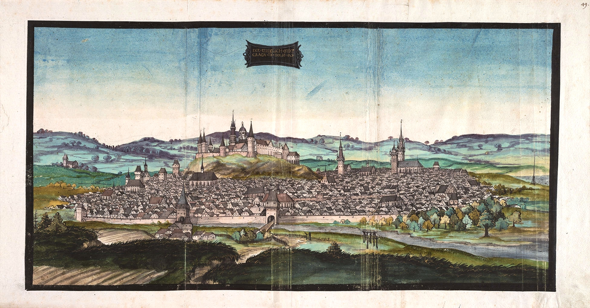
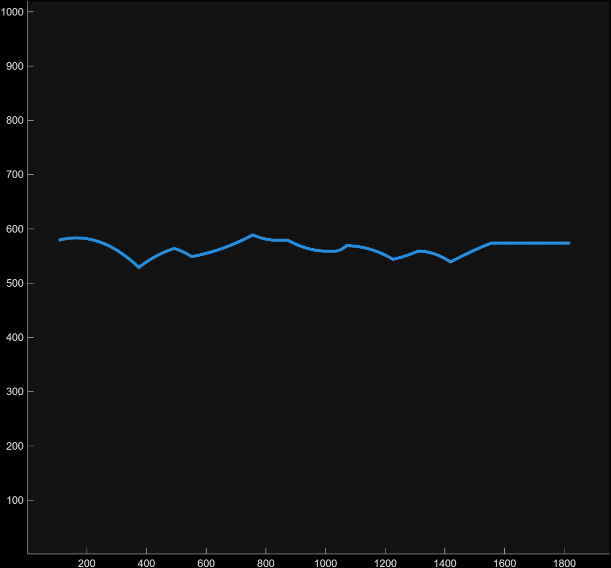
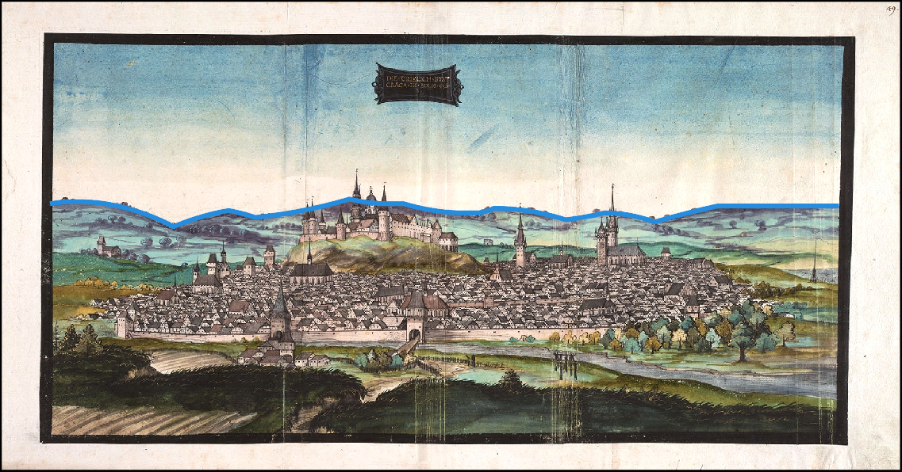

# Zadanie 1 - Robert Mesek

`splines_comp.m`
```matlab
function splines_comp(precision,knot_vector, coefficients)
% [...]
y_combined = zeros(1, length(x));
for i=1:nr
  y_combined = y_combined + coefficients(i) * compute_splines(knot_vector,p,i,x);
end
plot(x, y_combined, 'LineWidth', 3);
% [...]
```

`trace_image.m`
```matlab
my_image = imread("Reisealbum_Ottheinrich_Krakau_1537.jpg");

knot_vector  = [105, 105, 105, 374, 374, 493, 493, 551, 551, 756, 756, 840, 840, 874, 874, 1006, 1006, 1030, 1030, 1070, 1070, 1226, 1226, 1310, 1310, 1419, 1419, 1556, 1556, 1820, 1820, 1820];
coefficients = [440, 420, 490, 465, 455, 460, 470, 460, 430, 440, 440, 440, 440, 460,  460,  460,  460,  460,  450,  450,  475,  470,  460,  460,  480,  460,  445,  445,  445];
precision    = 1715;

hold on;
imshow(my_image);
splines_comp(precision, knot_vector, coefficients);
hold off;
```

`Reisealbum_Ottheinrich_Krakau_1537.jpg`


`my_image_spline.png`


`my_image_result.png`
