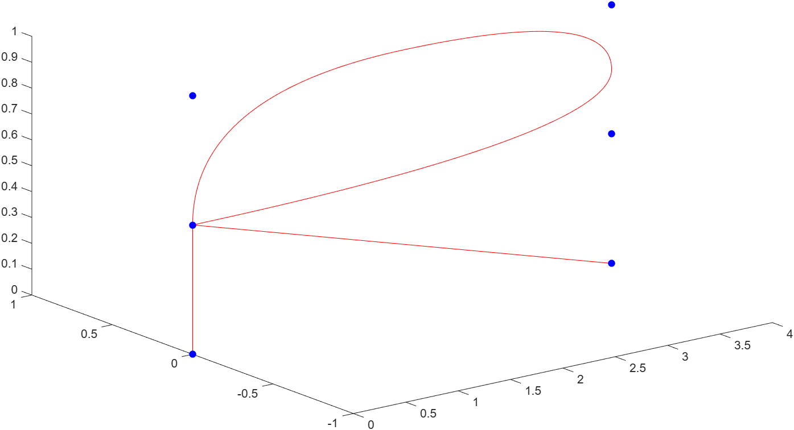
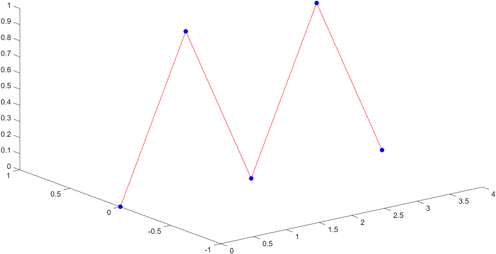
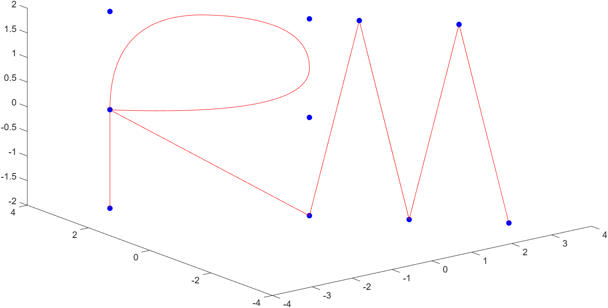

# Zadanie 2 - Robert Mesek

`bspline_curve3D.m`
```matlab
function bspline_curve3D(precision, knot_vector, points)
% [...]
[n, m] = size(points);

if (n ~= nr || m ~= 3)
    disp("Poorly constructed points array")
    return
end

x_begin = knot_vector(1);
x_end = knot_vector(size(knot_vector, 2));
x = mesh(x_begin, x_end);

res_x = zeros(1, numel(x));
res_y = zeros(1, numel(x));
res_z = zeros(1, numel(x));

for ind = 1:nr
    spline = compute_spline(knot_vector, p, ind, x);
    fprintf('\n');
    res_x = res_x + (spline .* points(ind, 1));
    res_y = res_y + (spline .* points(ind, 2));
    res_z = res_z + (spline .* points(ind, 3));
end

plot3(res_x, res_y, res_z, 'r')
axis tight; 
hold on

scatter3(points(:, 1), points(:, 2), points(:, 3), 'b', "filled")
hold off;
% [...]
```

`draw_initials.m`
```matlab
knot_vector_R = [0 0 0 1 1 2 3 4 4 5 5 5];
points_R = [0 0 0; 0 0 0.5; 0 0 0.5; 0 0 1; 4 0 1; 4 0 0.5; 0 0 0.5; 4 0 0; 4 0 0];

knot_vector_M = [0 0 0 1 1 2 2 3 3 4 4 4];
points_M = [ 0 0 0; 1 0 1; 1 0 1; 2 0 0; 2 0 0; 3 0 1; 3 0 1; 4 0 0; 4 0 0];

bspline_curve3D(1000, knot_vector_R, points_R);
bspline_curve3D(1000, knot_vector_M, points_M);
```

`letter_R.png`


`letter_M.png`


`draw_initials.m` (oba inicjały z rotacją)
```matlab
DEGREES = -45;

knot_vector_RM = [0 0 0 1 1 2 3 4 4 5 5   6 6 7 7 8 8 9 9 9];
points_RM = [-4 0 -2; -4 0 0; -4 0 0; -4 0 2; 0 0 2; 0 0 0; -4 0 0; 0 0 -2; 0 0 -2;   1 0 2; 1 0 2;  2 0 -2; 2 0 -2; 3 0 2; 3 0 2; 4 0 -2; 4 0 -2];

theta = deg2rad(DEGREES);
rotationMatrix = [cos(theta) -sin(theta) 0; sin(theta) cos(theta) 0; 0 0 1];
points_RM_rot = (rotationMatrix * points_RM')';

bspline_curve3D(1000, knot_vector_RM, points_RM_rot);
axis([-4 4 -4 4 -2 2]);
```

`letter_RM_rot45deg.png`
