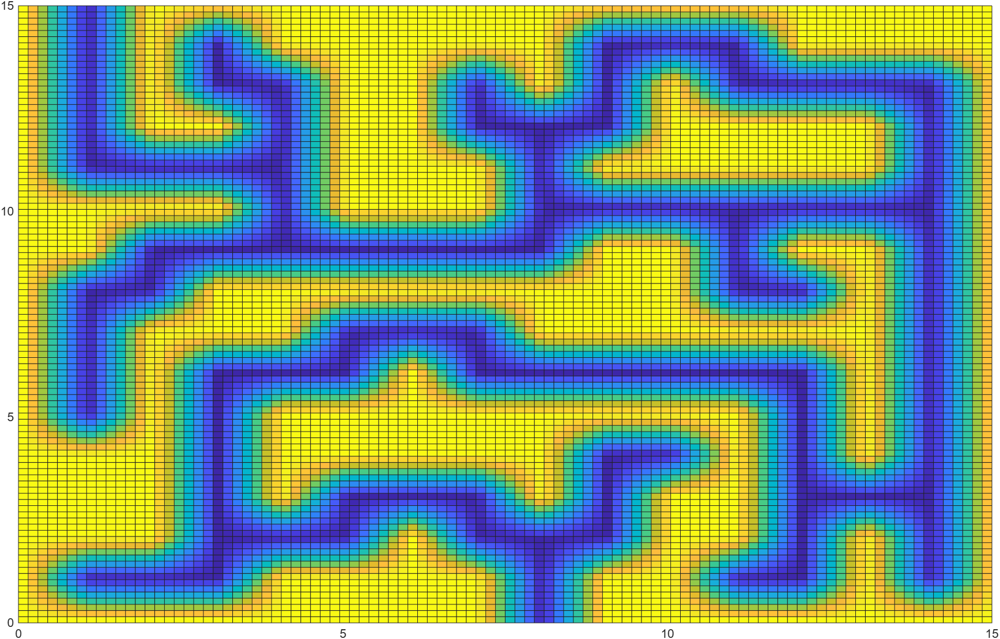
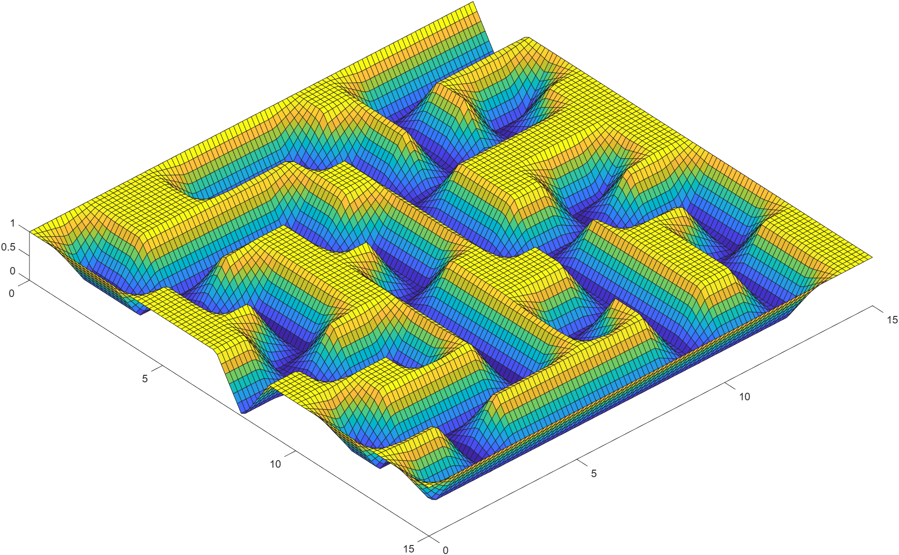

# Zadanie 3 - Robert Mesek

`spline2D_comp.m`
```matlab
function spline2D_comp()
% [...]
function spline2Duniform()
knot_vectorx = [0 0 1 2 3 4 5 6 7 8 9 10 11 12 13 14 15 15;]
knot_vectory = [0 0 1 2 3 4 5 6 7 8 9 10 11 12 13 14 15 15;]

coeffs = [
    1 1 1 1 1 1 1 1 1 1 1 1 1 1 1 1;
    1 0 1 1 1 0 0 0 0 1 1 0 0 0 0 0;
    1 0 1 1 1 1 1 1 0 0 1 0 1 1 1 1;
    1 0 0 0 0 0 0 1 1 0 1 0 1 0 0 1;
    1 1 0 1 1 1 0 1 1 0 0 0 0 0 1 1;
    1 1 0 0 1 1 0 0 1 0 1 1 1 1 1 1;
    1 1 1 0 1 1 1 0 1 0 1 1 1 1 1 1;
    1 1 0 0 1 1 0 0 1 0 1 1 0 0 1 1;
    0 0 0 1 1 1 0 1 1 0 0 0 0 1 1 1;
    1 1 0 0 0 1 0 1 1 1 0 1 0 0 0 1;
    1 1 1 1 0 1 0 1 1 1 0 1 1 1 0 1;
    1 0 1 1 1 1 0 1 0 0 0 1 1 0 0 1;
    1 0 0 0 0 0 0 1 0 1 0 1 1 0 1 1;
    1 1 1 0 1 1 1 1 1 1 0 1 1 0 1 1;
    1 0 0 0 0 0 0 0 0 0 0 0 0 0 1 1;
    1 1 1 1 1 1 1 1 1 1 1 1 1 1 1 1;
]

precision = 0.01
% [...]
%X and Y coordinates of points over the 2D mesh
[X,Y]=meshgrid(x,y);
Z = zeros(size(X));

hold on
for i=1:nrx
  %compute values of 
  vx=compute_spline(knot_vectorx,px,i,X);
  for j=1:nry
    vy=compute_spline(knot_vectory,py,j,Y);
    Z = Z + coeffs(i,j) * vx .* vy;
  end
end
surf(X,Y,Z);
hold off

end
% [...]
```

`labyrinth_2d.png`


`labyrinth_3d.png`
