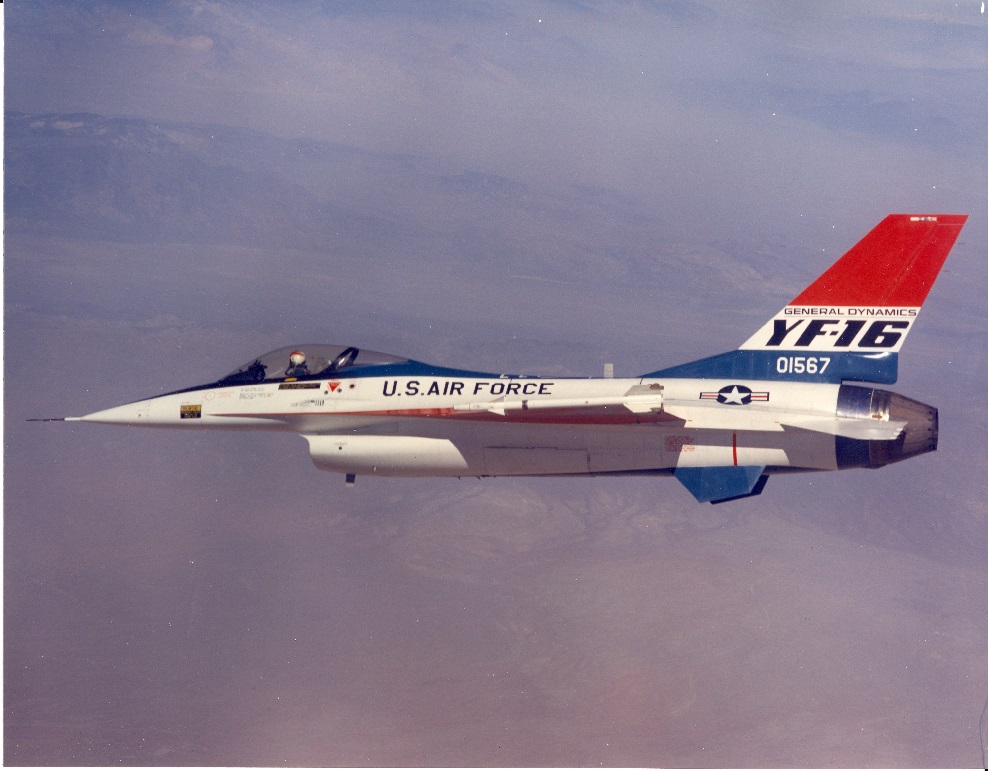

# Zadanie 4 - Robert Mesek

`bitmap_h.m`
```matlab
function bitmap_h(filename,elementsx,elementsy,maxerror,max_refinement_level,color_edges_black,mode)
% [...]
RR = XX(:,:,1); %Red color [0,255]
GG = XX(:,:,2); %Green color [0,255]
BB = XX(:,:,3); %Blue color [0,255]
RR_out = zeros(size(RR), 'uint8');
GG_out = zeros(size(GG), 'uint8');
BB_out = zeros(size(BB), 'uint8');

if strcmp(mode, 'R')
    GG = zeros(size(GG));
    BB = zeros(size(BB));
end
if strcmp(mode, 'G')
    RR = zeros(size(RR));
    BB = zeros(size(BB));
end
if strcmp(mode, 'B')
    RR = zeros(size(RR));
    GG = zeros(size(GG));
end
% [...]
redo_error_test = true;
refinemenet_level = 0;

% interpolate all active elements - recreate bitmap red green and blue compoments
for i=1:total_elements
  if (elements(i).active)
    interpolate_elem(i,color_edges_black);
  end
end

% recreate bitmap from red, green and blue compoments
RGB=XX;
RGB(:,:,1) = RR_out;
RGB(:,:,2) = GG_out;
RGB(:,:,3) = BB_out;

% display image
% imshow(RGB);

% save image
filename_out = sprintf('out/%s_%s_%02d_%s', mode, string(color_edges_black), refinemenet_level, filename);
imwrite(RGB, filename_out);
% [...]
  RGB=XX;
  RGB(:,:,1) = RR_out;
  RGB(:,:,2) = GG_out;
  RGB(:,:,3) = BB_out;

  % display image
  % imshow(RGB);

  % save image
  filename_out = sprintf('out/%s_%s_%02d_%s', mode, string(color_edges_black), refinemenet_level, filename);
  imwrite(RGB, filename_out);

end
% [...]
function interpolate_elem(element,color_edges_black)
% [...]
  for xx=0:width
    for yy=0:hight
      [r,g,b] = inpoint(xx,yy,width,hight,elem);
      RR_out(dlx+xx,dly+yy) = r;
      GG_out(dlx+xx,dly+yy) = g;
      BB_out(dlx+xx,dly+yy) = b;
    end
  end
  
% create black edges on element if requested
  if (color_edges_black)
    for xx=0:width
      RR_out(dlx+xx,dly) = 0;
      GG_out(dlx+xx,dly) = 0;
      BB_out(dlx+xx,dly) = 0;
      
      RR_out(dlx+xx,dly+hight) = 0;
      GG_out(dlx+xx,dly+hight) = 0;
      BB_out(dlx+xx,dly+hight) = 0;
    end
    
    for yy=0:hight
      RR_out(dlx,dly+yy) = 0;
      GG_out(dlx,dly+yy) = 0;
      BB_out(dlx,dly+yy) = 0;
      
      RR_out(dlx+width,dly+yy) = 0;
      GG_out(dlx+width,dly+yy) = 0;
      BB_out(dlx+width,dly+yy) = 0;
    end
  end
end
% [...]
```

`run.m`
```matlab
bitmap_h("yf16.bmp",8,8,2,8,true,'RGB');
bitmap_h("yf16.bmp",8,8,2,8,false,'RGB');
bitmap_h("yf16.bmp",8,8,2,8,true,'R');
bitmap_h("yf16.bmp",8,8,2,8,false,'R');
bitmap_h("yf16.bmp",8,8,2,8,true,'G');
bitmap_h("yf16.bmp",8,8,2,8,false,'G');
bitmap_h("yf16.bmp",8,8,2,8,true,'B');
bitmap_h("yf16.bmp",8,8,2,8,false,'B');
```

`yf16.bmp`


`out/RGB_true_00_yf16.bmp`


`out/RGB_true_01_yf16.bmp`


`out/RGB_true_02_yf16.bmp`


`out/RGB_true_03_yf16.bmp`


`out/RGB_true_04_yf16.bmp`


`out/RGB_true_05_yf16.bmp`


`out/RGB_true_06_yf16.bmp`


`out/RGB_true_07_yf16.bmp`


`out/RGB_true_08_yf16.bmp`


`out/RGB_false_08_yf16.bmp`

