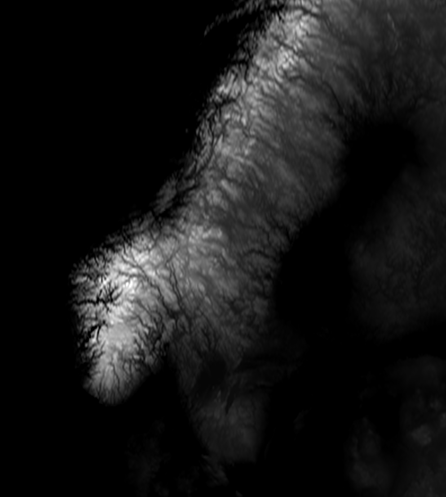

# Zadanie 5 - Robert Mesek

`bitmap_terrain.m`
```matlab
function spline2D_comp()
% [...]
% read image
X = imread(filename); %to make it upside down just add 255 - 
X = flipud(X);
% [...]
surf(X,Y,Z);

% Rotating images generation
for angle = 0:359
    view(-30 + angle, 45);
    drawnow;
    frame = getframe(gcf);
    filename = sprintf('out/frame%03d.png', angle);
    imwrite(frame.cdata, filename);
end
% [...]
```

`run.m`
```matlab
bitmap_terrain("szwecja.png",200,2)
```

`szwecja.png`


`out/frame015.png`


Animacja została stworzona z wykorzystaniem strony [ezgif.com](https://ezgif.com/)