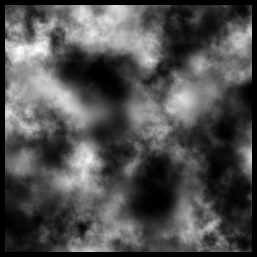

# Zadanie 6 - Robert Mesek

`heat_time_matlab.m`
```matlab
% Input data
knot = simple_knot(16, 2); % knot vector (16,2)
                           %[ 16 intervals and quadratic B-splines]
dt = 0.0001;               % time step size
theta = 0;                 % scheme parameter (0 - explicit Euler, 1 - implicit Euler, 1/2 - Crank-Nicolson)
K = 100;                   % number of time steps
% [...]
f = @(t, x) 0;
init_state = @(x) init_state_from_image(x, "heightmap.png");
% [...]
function y=init_state_from_image(x, filename)
  img = imread(filename);
  img = flipud(img);
  img = rgb2gray(img);
  img = im2double(img) * 0.8;
  [h, w] = size(img);

  col = round(x(1) * (w - 1)) + 1;
  row = round((1 - x(2)) * (h - 1)) + 1;
  y = img(row, col);
end
% [...]
```

`heightmap.png`  


`out/frame000.png`  


`out/frame025.png`  


`out/frame050.png`  


`out/frame075.png`  


`out/frame100.png`  


Animacja została stworzona z wykorzystaniem strony [ezgif.com](https://ezgif.com/)